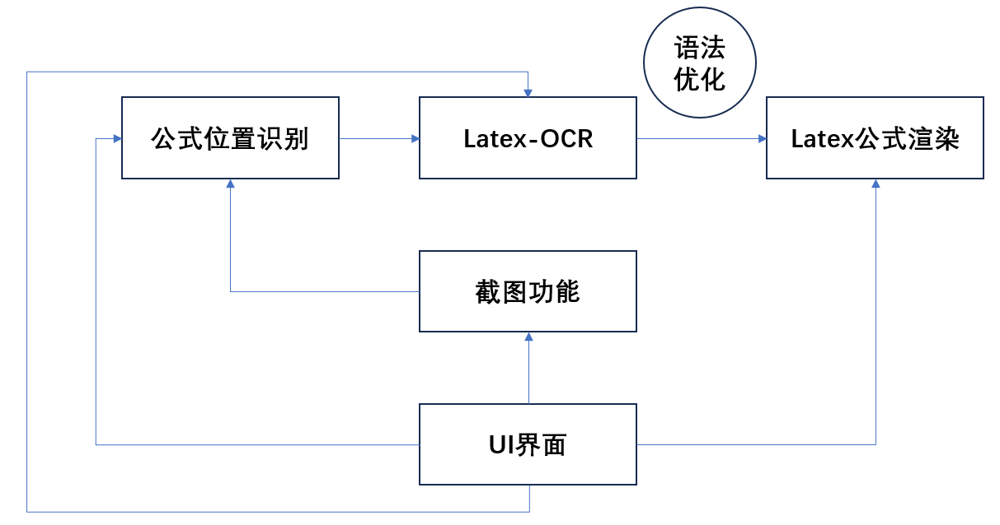
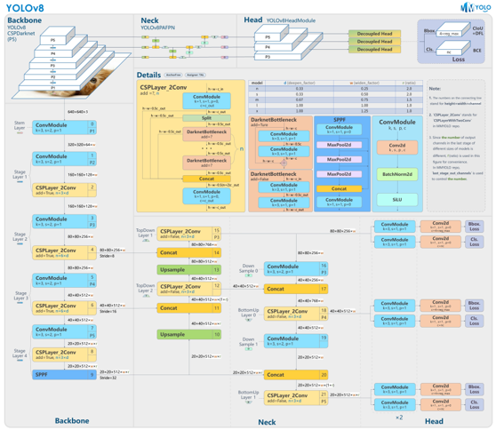
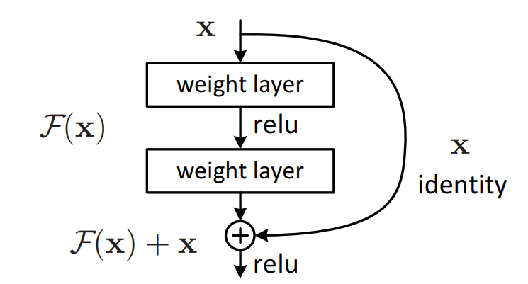

### 基于深度学习的Latex公式提取器设计
> 没有论文模板，就先拿md把论文的内容写了

### 目录
* 摘要
* Abstract
* 研究现状分析
* 研究方法与原理
* 实验与分析
* 结论
* 参考文献

### 摘要
&emsp;&emsp;Latex公式除了用于Latex文档以外，也广泛使用于markdown文本的公式记录中。为了应对日常生活中对Latex公式的提取要求，避免记忆复杂的Latex公式语法，本文利用各种开源工具实现了一种简易识别、提取Latex公式的语法表达式工具，旨在实现Latex公式的快速提取。 
&emsp;&emsp;首先本文对OCR领域目前的研究现状进行了分析，介绍了目前OCR领域常见的方法以及待解决的问题。 
&emsp;&emsp;随后介绍了本工具的方法与流程，并对其中主要部分进行了原理与创新性分析。其中，公式位置识别部分采用YOLOv8框架与其预训练模型进行微调，Latex公式OCR采用开源模型Latex-OCR，其模型采用了带有 ResNet 主干网的 ViT 编码器和 Transformer 解码器，本文对此方案进行了性能分析。公式渲染输出部分采用了Matplotlib库的mathtext模块，并对其他可行的渲染方案进行了介绍。工具的UI界面设计采用Tkinter库进行设计，并通过Tkinter库实现了屏幕截图，同时设计了多线程实现了公式实时渲染。 
&emsp;&emsp;最后，论文对本工具的性能进行了分析并总结了可优化的部分。经过测试，本工具可以满足日常对公式提取的一般需求，并预留了可优化空间，便于二次开发。 
**关键词：Latex公式提取；光学字符识别；深度学习；视觉识别**

### Abstract
&emsp;&emsp;The Latex formula is not only used for Latex documents, but also widely used in formula records of markdown text. In order to meet the requirements of extracting Latex formulas in daily life and avoid memorizing complex Latex formula syntax, this article uses various open-source tools to implement a simple syntax expression tool for recognizing and extracting Latex formulas, aiming to achieve rapid extraction of Latex formulas. 
&emsp;&emsp;Firstly, this article analyzes the current research status in the field of OCR, introduces common methods and problems to be solved in the field of OCR.  
&emsp;&emsp;Subsequently, the method and process of this tool were introduced, and the main parts were analyzed for principles and innovation. Among them, the YOLOv8 framework and its pre-trained model are used for fine-tuning the formula position recognition part. The Latex formula OCR adopts the open-source model Latex-OCR, which uses a ViT encoder and Transformer decoder with ResNet backbone. This article analyzes the performance of this scheme. The formula rendering output section adopts the mathtext module of the Matplotlib library, and introduces other feasible rendering schemes. The UI interface of the tool was designed using the Tkinter library, and screenshots were achieved through the Tkinter library. At the same time, multithreading was designed to achieve real-time formula rendering. 
&emsp;&emsp;Finally, the paper analyzed the performance of this tool and summarized the parts that can be optimized. After testing, this tool can meet the general needs of formula extraction in daily life, and reserves space for optimization, making it easy for secondary development. 
**Keywords: Latex formula extraction; OCR; Deep learning; Visual recognition**

### 研究现状分析
&emsp;&emsp;Latex公式提取本质上还是光学字符识别（OCR）问题，输入是公式的图像，输出是LaTeX格式的数学公式字符串，要想字符串提取准确，首先需要高精度的OCR方案。光学字符识别（OCR）是一项将图像中的文字内容转化为计算机可处理文本的技术。在早期，OCR使用人工设定的低层特征提取方法，但这导致了低维度、粗糙的特征，以及繁琐的前后处理。然而，深度学习（DL）的引入解决了特征提取问题，并使OCR取得了重大进展。OCR面临的挑战包括处理自然场景中多样性和可变性的文本、复杂背景和干扰、以及不完善的图片成像条件。近年来，针对这些挑战的研究成果包括： 
1.利用深度学习技术，如卷积神经网络和循环神经网络，提高了OCR的准确性，尤其是在处理多样性和可变性的文本方面。 
2.建立更具挑战性的算法和数据集，包括多语言、手写文本、自然场景文本和具有复杂背景的文本，以帮助改进OCR系统的性能。 
3.辅助技术的进步，如文本定位、文本分割和文本布局分析，以提高OCR系统的鲁棒性和准确性。 
&emsp;&emsp;这些进展使OCR在各种领域，包括自然场景、文档处理和信息提取，发挥着越来越重要的作用。深度学习、挑战性数据集和辅助技术的发展是OCR技术不断进步的关键因素。 
&emsp;&emsp;OCR领域目前常用的数据集有SynthText(ST)[1]、ICDAR(International Conference on Document Analysis and Recognition)比赛用数据集[2]、 COCO-Text[3]、IIIT 5k words[4]、ICDAR 2017 RCTW[5]。 
&emsp;&emsp;SynthText可以被看作是OCR领域的ImageNet，这个数据集于2016年由牛津大学工程科学系视觉几何组的成员在CVPR会议上发布。它为OCR研究提供了大规模的图像和标注，类似于ImageNet对计算机视觉的影响。ICDAR比赛提供了多个数据集，包括2003、2013和2015年的版本。这些数据集的每张图片都来自真实场景并经过标注，但样本数量相对较少，总共只有几千张图片。COCO-Text是ICDAR 2017 Robust Reading Challenge的数据集，类似于ICDAR，这些图像也是从实际场景中采集的，但规模要大得多，共包含了63686个样本。IIIT 5k words数据集是从谷歌图像搜索中获取的，主要包括广告牌、招牌、门牌号、门牌和电影海报等用于图像收集的样本。这个数据集包含了5000个样本。ICDAR大赛中文识别数据集RCTW（Reading Chinese Text in the Wild）包括一万多张含有中文文本的自然场景图片。 
&emsp;&emsp;总的来说，除了第一个SynthText（ST）数据集具有较大规模，其他数据集大多不足以单独训练一个强大的OCR模型。通常的做法是，根据特定的识别场景（如中文或英文、街景或文档等），首先使用SynthText（ST）数据集进行训练，然后再使用较小规模的数据集进行微调，以提高模型的性能。这种迁移学习方法对于克服数据稀缺性问题非常有用。 
&emsp;&emsp;常用的OCR分为文本位置检测与文本识别两个主要任务，文本位置检测负责找出图片中文字的位置，文本识别提取文字内容。其中，文本位置检测常用的算法有CTPN[6]、CRAFT[7]、Seglink[8]、EAST[9]等，文本识别主要有CRNN：CNN+RNN+CTC[10]、CNN+Seq2Seq+Attention[11]两种主要方案 
&emsp;&emsp;CTPN的核心思想是将图像按宽度分成16像素宽的小格，逐一检测每个小格内是否包含文本，并同时预测文本的高度和宽度。最后，将多个检测结果融合以形成最终的文本框。对于水平文本，CTPN的文本检测效果很出色。然而，CTPN有一个显著的缺点，即对于倾斜和弯曲的文本的检测效果较差，这是由于其模型原理的限制，难以通过训练来解决这个问题。CRAFT是由韩国的CLOVA AI公司于2019年提出的算法，具有能够识别任意角度文本的能力，同时可以为图像中的每个像素提供关于是否包含文本的置信度。CRAFT采用像素级别的预测，因此不会漏掉图像中的小文本。Seglink在复杂场景中的文本识别效果优于CTPN。EAST是在Seglink基础上的改进算法，它在保持复杂场景准确度的同时优化了倾斜和弯曲文本的识别效果。目前来看，CTPN是应用最广泛的文本检测算法，但由于在倾斜文本上的不足，其应用场景受到了一定的限制。与此不同，CRAFT表现出高效的特点，因为它可以得到每个像素是否属于文本的置信度，并可以在不同场景下进行有针对性的调优。因此，CRAFT值得进行深入研究。 
&emsp;&emsp;文本识别当前应用最为广泛的模型为 CNN+RNN+CTC，其中CNN用于提取图像特征，RNN在CNN提取特征的基础上，通过双向LSTM提取相邻下像素之间的特征，最后CTC用于计算损失函数。其中CTC实现不定长输入问题的损失函数计算，在语音识别领域应用广泛。CNN+Seq2Seq+Attention引入了attention机制，效果相当好，后续可能逐渐替代CRNN成为主流。 
&emsp;&emsp;公式识别是OCR领域一个非常有挑战性的工作，工作的难点在于它是一个二维的数据，因此无法用传统的CRNN进行识别。常用数据集有im2latex100k[12]。由于Latex公式的特殊性，很多项目训练时都是采用Latex软件随机渲染生成数据集，对公开的大型数据集的需求不像常规OCR那么高。目前公式OCR主要方案有Seq2Seq模型[13]与基于transformer的ViT模型[14]，两者都能实现较高的准确度。Seq2Seq模型的主要特点有两点：使用buckets的思想对图像进行归并，减轻了公式识别数据中尺寸差异过大的学习难度；解码器的思想设计的比较精巧，基本上是围绕公式的数据特征进行设计的。ViT则采用了transformer作为编解码器的思路，在实现上相对更轻量化。

### 研究方法与原理
&emsp;&emsp;本项目使用yolov8(ultralytics-main)识别出公式位置；如果不截出纯公式图，Latex-OCR会把非公式部分强行识别为公式，输出乱码；随后使用开源项目Latex-OCR(pix2tex)识别出公式的Latex表达式，并使用optimize文件中的规则进行结果优化；最后使用matplotlib库进行公式渲染作为预览。UI界面设计与组件逻辑联系使用Tkinter完成。 

#### 1.公式位置识别
&emsp;&emsp;首先，本设计使用PIL和Tkinter库实现了功能类似QQ截图的鼠标画框手动截图。本设计创建了一个用于截图的class，其初始化函数包括创建一个半透明、全屏、总在最上层的窗口、获取屏幕的宽度和高度、创建一个画布，用于绘制选中区域的矩形框、绑定鼠标左键点击、释放、拖拽事件以及Esc键的退出事件。随后，捕获到鼠标左键点击事件时，记录鼠标按下的位置，作为选中区域的起始坐标；在鼠标释放时，根据起始坐标和当前鼠标位置，截取屏幕区域并保存为 "tmp.png"。关闭窗口，退出截图模式。在鼠标拖拽时触发事件：鼠标左键按住并拖拽时，绘制选中区域的矩形框，实时跟随鼠标位置。用户可以按下Esc键，触发退出事件，关闭窗口并退出截图模式。 
&emsp;&emsp;在获取了带有公式的图片以后，针对公式位置识别的第一阶段任务，本设计选择YOLOv8框架作为基础。YOLOv8是目前目标检测是SOTA模型，其在前代基础上主要做出了四点创新，显著的提升了模型的效率。在模型结构上：YOLOv8删除了1*1的降采样层，同时也将C3模块替换为了C2f模块；头部更换为解耦头，将分类头和检测头分离；损失函数：YOLOv8使用VFL Loss作为分类损失，使用DFL Loss+CIOU Loss作为分类损失；样本匹配：YOLOv8抛弃了以往的IOU匹配或者单边比例的分配方式，而是使用了Task-Aligned Assigner匹配方式。 
 
&emsp;&emsp;本次设计使用最轻量化的预训练模型yolov8n并在此基础上采用自己标注的公式位置数据集进行fine-tuning；数据集采自《深度学习》一书，约一百余张图片，公式的特征较为明显，同时为了保证使用的相对流畅，最轻量化的预训练模型已经足够。 
&emsp;&emsp;关于数据集的标注方法，本设计使用开源工具labelImg进行标注，生成包含目标的分类与位置框的XML文件，随后将样本按照9：1的比例划分为训练集与验证集，使用python脚本随机分配并以YOLOv8需要的格式提取XML文件中的信息到txt文件中，交付YOLOv8进行fine-tuning。

#### 2.公式表达式提取
&emsp;&emsp;本部分的实现基于开源项目Latex-OCR，此项目使用了自己标注的、在wikipedia，arXiv等网站上的文章中找到的公式以及im2latex-100k数据集。其模型采用了带有ResNet[15]主干网的ViT编码器和Transformer解码器。 
&emsp;&emsp;ResNet模型是2015年ImageNet图像竞赛全项冠军，其首次在准确度上超过了人类的水平，同时其解决了网络退化问题（ResNet的深度是152层，远大于GoogleNet的22层和VGG的19层，网络可以提取出更深的特征），使得网络深度可以进行更多的叠加，让神经网络可以适应于更多的情况。ResNet创建了残差模块，通过将输入恒等映射到输出，使得神经网络的拟合只需要拟合网络的残差而非拟合网络本身的全部底层规律。拟合残差最差也只会使得网络仅做恒等变换，不会使网络性能下降。拟合残差对神经网络来说更容易(多层神经网络很难拟合恒等映射)。在实际情况下，恒等映射多半并非为最优，后面的网络仅需拟合前面网络的输出与期望函数的残差。残差模块输出的响应更小(因为其仅需拟合残差，比完整映射幅度小很多)。 
 
关于残差模块可以解决网络退化问题的可能原因，目前认为的可能原因有：
* 恒等映射这一路的梯度是1，则总梯度最起码是1，可以将深层梯度传给底层，防止出现梯度消失
* 类比其他模型：机器学习boosting方法(多个弱分类器拟合，后面的着重修正前一分类器的错误，完成后合并决策边界，形成一个强分类器)，残差也可以起到修正前面神经元错误的作用
* 传统线性结构网络难以拟合恒等映射,而ResNet模型可以自行决定是否修正残差，可以选择是否更新，一定程度上弥补了高度非线性造成的不可逆信息损失
* ResNet反向传播传回的梯度相关性好：随着网络加深，相邻像素的梯度相关性越来越低，最后接近白噪声。但ResNet梯度相关性衰减更慢，能保持梯度相关性
* ResNet相当于几个浅层网络的集成：每个节点有两条路，其n个节点有2^n个潜在路径(类似dropout)；测试时去掉某几个残差块后几乎不影响性能。其为非传统的并行结构
* skip connection可以实现不同分辨率特征的组合：恒等映射和残差块对应不同尺度的特征，其在求和时相当于进行了特征整合

&emsp;&emsp;Transformer的Self-Attention、Multi-Head Attention、编码器-解码器架构等新机制使得其在自然语言处理模型性能上表现出了巨大的成功，而Decoder相较于encoder部分增加一个Masked Multi-head attention，目的是防止看到未来信息，即仅根据当前及之前已解码的内容来推算即将预测的内容。ViT将Tranformer应用于视觉领域并取得了巨大的成功。ViT接受图片作为输入，但与CNN不同，它将图像分成一组小的图块（patches），每个图块通常是固定大小的。这些图块被视为序列的元素。由于ViT忽略了图像中像素之间的空间位置信息，它引入了位置编码，以为模型提供关于每个图块在原始图像中的位置信息。每个图块首先通过一个嵌入层转换为较低维度的向量表示，类似于自然语言处理中的词嵌入。Transformer编码器作为ViT的核心部分，它包括多个Transformer编码器层。每个编码器层包括自注意力（Self-Attention）机制和前馈神经网络。这些编码器层用于捕捉图块之间的关系和特征。最后，ViT的输出是一个特殊的CLS标记的表示，经过线性层后用于分类任务。这个CLS标记可以看作是整个图像的表示。ViT仅使用了Transformer的encoder，根据MLP和CLS标记最后输出图像的Class。 
&emsp;&emsp;Latex-OCR模型设计了两种结构，一是以ResNet作为主干网络提取特征向量作embedding层输入给ViT encoder，提取出与输入相同尺寸的矩阵给到Transformer decoder并使用Transformer decoder输出文本的结合架构；二是使用完整的ViT Encoder（embedding层是拆解图像放进全连接层）和 Transformer Decoder 的组合架构；当模型较小时，混合模型的表现要更好，但是随着模型的增大，ViT的表现超过了混合模型。本项目的数据集并不大，混合模型效果更好。

#### 3.公式渲染
&emsp;&emsp;在提取出了公式表达式后，需要将公式渲染成图片供用户预览效果，常规的python渲染Latex公式方案主要有以下三种。 
&emsp;&emsp;方案一：基于LaTeX环境；该方案需要安装LaTeX环境。优点是支持所有的LaTeX文档的渲染，缺点是环境过于臃肿，不便部署。 
&emsp;&emsp;方案二：基于KaTeX；KaTeX 是一个快速，易于使用的JavaScript库，用于在Web上进行TeX数学渲染。优点是支持大部分LaTeX语法，缺点是需要python额外调用web服务，集成性较差同时基于此方案的实现很少，没有参考资料。 
&emsp;&emsp;方案三：基于Matplotlib；Matplotlib 实现了一个轻量级的 TeX 表达式解析器和布局引擎，Mathtext 是该引擎支持的 Tex 标记的子集，使用此模块的math_to_image函数可以实现简单的渲染，优点是便捷且易于集成，缺点是不支持很多较为高级的语法与标签。 
&emsp;&emsp;基于轻量化且便于操作的原则，本项目选择方案三。
#### 4.UI设计
&emsp;&emsp;相比于需要额外配置的QT，本设计选择了python自带的UI库Tkinter，其优点是更轻量化，部署时无需额外配置，缺点是没有可视化设计界面，UI设计全靠手动设计代码。针对前面识别环节可能出现的错误，本程序设计了实时渲染的功能，便于修改生成的Latex公式代码并实时查看效果。另外，本设计将UI界面、Latex公式实时渲染、语法检查与状态指示拆分到三个不同的线程中，并通过全局变量互相交互信息来优化操作体验。 
&emsp;&emsp;在调试中遇到了matplotlib线程冲突报错：Tcl_AsyncDelete: async handler deleted by the wrong thread，在打开实时渲染模式时使用带渲染的功能会出现线程冲突。经排查是两个线程同时调用渲染导致线程冲突，故设计为调用其他包含渲染的功能时会暂时暂停实时渲染线程，从而避免的线程冲突。
### 实验与分析
&emsp;&emsp;经测试，本设计可以较为准确的识别出公式位置并提取出Latex表达式，但本项目仍旧存在一些问题。首先是由于公式位置训练集是本人手动标注的小数据集，有时候会出现公式只有一部分被识别出来的问题，另外针对不标准字体的公式，Latex-OCR给出的表达式也会出现不准确的问题。针对这些问题，只需要扩大数据集即可很大程度的解决。另外，Matplotlib不支持高级语法的问题导致渲染时经常无法渲染语法正确但含有高级标签的表达式并且目前没有很好的解决方法。可能集成基于Chrome内核或者基于KateX的渲染包可以更好的解决，但目前没有很好的集成方法。有待下一步研究来提高渲染效果。
### 总结

&emsp;&emsp;本文的研究内容主要是基于深度学习的Latex公式提取。首先本文对OCR领域目前的研究现状进行了分析，介绍了目前OCR领域常见的方法以及待解决的问题。针对项目的流程，主要分为了公式位置识别、公式表达式提取、公式实时渲染与UI设计四个部分进行介绍，各部分具体内容如下： 
&emsp;&emsp;1.公式位置识别；介绍了基于PIL与Tkinter的截屏方案，并将获取的图片输入到YOLOv8模型中获取公式的位置。本部分介绍了YOLOv8相对于前代的创新点，并介绍了自己的数据集标注流程，提高了可复现性。 
&emsp;&emsp;2.公式表达式提取；介绍了本项目使用的采用开源模型Latex-OCR与其模型采用的带有ResNet主干网的ViT编码器和Transformer解码器。本文对ResNet进行了简述，介绍了其独创的残差模块的原理，并提出了一些可能解释其效果的原因。随后，对Transformer和其在视觉领域的应用ViT进行了简要的原理介绍，并说明了其encoder和decoder的区别，对两种模型的不同结合方法进行了对比，并得出了ResNet作为编码器和Transformer作为解码器的结合架构性能更优的结论。 
&emsp;&emsp;3.公式渲染；公式渲染输出部分采用了Matplotlib库，并对其他可行的渲染方案进行了介绍。 
&emsp;&emsp;4.UI设计；说明了本设计UI设计的流程与思路，并说明了实现公式实时渲染的多线程设计原则。另外，针对调试时出现的线程冲突问题给出了合理解释，并说明了修正方案。 
&emsp;&emsp;经测试，本设计在较为简单的环境中表现较为优秀，同时针对识别出现的错误可以利用参照实时渲染来进行手动修正。但是本设计在复杂环境中仍旧存在一些问题，比如在复杂公式环境下可能出现定位不准与识别出错，针对这些问题，扩大数据集是可能的最优解决方案。但Matplotlib的Tex库过小导致不能渲染高级标签的问题暂时没有合适的解决方案，有待下一步研究解决。

### 参考文献
[1] Gupta A, Vedaldi A, Zisserman A. Synthetic data for text localisation in natural images[C]//Proceedings of the IEEE conference on computer vision and pattern recognition. 2016: 2315-2324. 
[2] Karatzas D, Gomez-Bigorda L, Nicolaou A, et al. ICDAR 2015 competition on robust reading[C]//2015 13th international conference on document analysis and recognition (ICDAR). IEEE, 2015: 1156-1160. 
[3] Gomez R, Shi B, Gomez L, et al. Icdar2017 robust reading challenge on coco-text[C]//2017 14th IAPR International Conference on Document Analysis and Recognition (ICDAR). IEEE, 2017, 1: 1435-1443. 
[4] Mishra A, Alahari K, Jawahar C V. Scene text recognition using higher order language priors[C]//BMVC-British machine vision conference. BMVA, 2012. 
[5] Shi B, Yao C, Liao M, et al. Icdar2017 competition on reading chinese text in the wild (rctw-17)[C]//2017 14th iapr international conference on document analysis and recognition (ICDAR). IEEE, 2017, 1: 1429-1434. 
[6] Tian Z, Huang W, He T, et al. Detecting text in natural image with connectionist text proposal network[C]//Computer Vision–ECCV 2016: 14th European Conference, Amsterdam, The Netherlands, October 11-14, 2016, Proceedings, Part VIII 14. Springer International Publishing, 2016: 56-72. 
[7] Baek Y, Lee B, Han D, et al. Character region awareness for text detection[C]//Proceedings of the IEEE/CVF conference on computer vision and pattern recognition. 2019: 9365-9374. 
[8] Shi B, Bai X, Belongie S. Detecting oriented text in natural images by linking segments[C]//Proceedings of the IEEE conference on computer vision and pattern recognition. 2017: 2550-2558. 
[9] Zhou X, Yao C, Wen H, et al. East: an efficient and accurate scene text detector[C]//Proceedings of the IEEE conference on Computer Vision and Pattern Recognition. 2017: 5551-5560. 
[10] Shi B, Bai X, Yao C. An end-to-end trainable neural network for image-based sequence recognition and its application to scene text recognition[J]. IEEE transactions on pattern analysis and machine intelligence, 2016, 39(11): 2298-2304. 
[11] Baek J, Kim G, Lee J, et al. What is wrong with scene text recognition model comparisons? dataset and model analysis[C]//Proceedings of the IEEE/CVF international conference on computer vision. 2019: 4715-4723. 
[12] Deng Y, Kanervisto A, Ling J, et al. Image-to-markup generation with coarse-to-fine attention[C]//International Conference on Machine Learning. PMLR, 2017: 980-989. 
[13] Xu K, Ba J, Kiros R, et al. Show, attend and tell: Neural image caption generation with visual attention[C]//International conference on machine learning. PMLR, 2015: 2048-2057. 
[14] Vaswani A, Shazeer N, Parmar N, et al. Attention is all you need[J]. Advances in neural information processing systems, 2017, 30. 
[15] He K, Zhang X, Ren S, et al. Deep residual learning for image recognition[C]//Proceedings of the IEEE conference on computer vision and pattern recognition. 2016: 770-778. 
